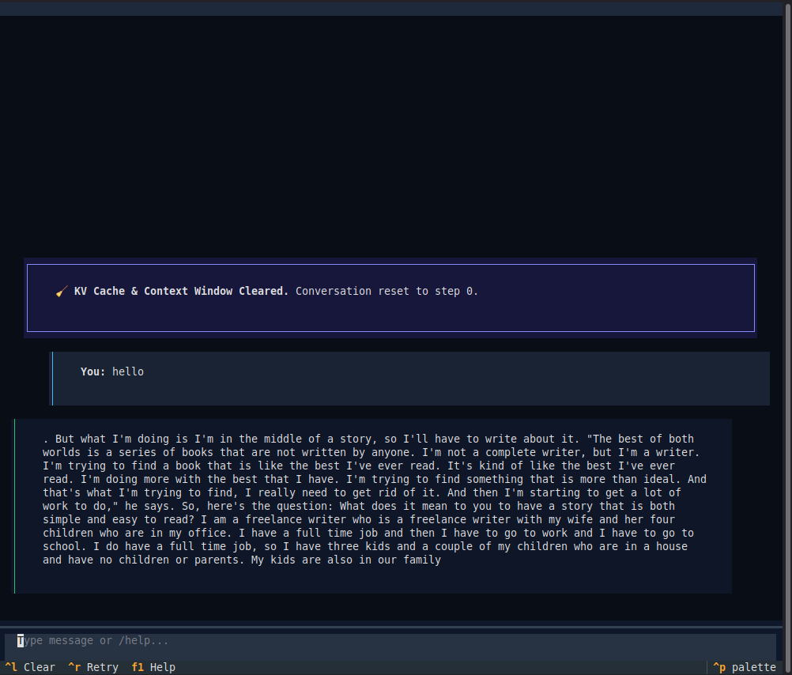

# Tinygrad High-Performance Transformer Optimization & Training Engine

High-performance, hardware-optimized Transformer model training and inference engine built on [tinygrad](https://github.com/tinygrad/tinygrad). Designed for high-speed training and real-time interactive text generation on NVIDIA Ada Lovelace GPUs.

## Objectives & Target Performance

- **Target Model Architecture**: 125M Parameter Transformer (`d_model=768`, `n_layers=12`, `n_heads=12`, `d_ff=3072`, `vocab_size=14,080` padded).
- **End Goal**: Complete a **1 Billion token** training run in **under 4 hours** (< 240 minutes).

---

## 2-Stage Pipeline Architecture

```text
┌─────────────────────────────────────────────────────────────┐
│ 1. HARNESS SUITE (Stage 1: src/harness.py)                  │
│    ├── Phase 1: Micro-Batch OOM-Safe Sweep                  │
│    ├── Phase 2: BEAM Compiler Search (BEAM=0 -> 2 -> 4)     │
│    └── Phase 3: SwiGLU Activation Fusion                    │
└──────────────────────────────┬──────────────────────────────┘
                               │ Writes conf/best_config.json
                               ▼
┌─────────────────────────────────────────────────────────────┐
│ 2. MAIN PRODUCTION TRAINER (Stage 2: src/train_production.py)│
│    ├── Loads conf/best_config.json                          │
│    ├── Streams dataset via np.memmap                        │
│    ├── Cosine LR Decay + Warmup Schedule                    │
│    └── Safetensors Checkpointing & Validation Loss Evaluation │
└──────────────────────────────┬──────────────────────────────┘
                               │ Checkpoints safetensors
                               ▼
┌─────────────────────────────────────────────────────────────┐
│ 3. INTERACTIVE CHAT ENGINE (chat.py / src/chat_engine.py)   │
│    ├── Stateful JIT Warm @TinyJit Execution                 │
│    ├── O(1) KV-Cache Rewinding                              │
│    └── Textual Terminal UI with Live Telemetry Overlay      │
└─────────────────────────────────────────────────────────────┘
```

---

## Project Structure

```text
tiny_train/
├── assets/                   # UI documentation assets & screenshots
│   └── chat_ui.png           # Interactive Textual TUI screenshot
├── conf/                     # Configuration files & telemetry output
│   ├── config.json
│   ├── best_config.json
│   └── score.json
├── src/                      # Source code modules
│   ├── __init__.py
│   ├── chat_engine.py        # Stateful JIT Warm LLM Chat Engine
│   ├── model.py              # Transformer model architecture
│   ├── train_production.py   # Production training engine
│   ├── harness.py            # Optimization suite & execution wrapper
│   ├── optimize.py           # Automated transient optimization loop with TUI
│   └── retokenize.py         # Dataset tokenization script
├── chat.py                   # Textual Interactive TUI Chat Application
├── run.py                    # Inference CLI harness & TUI launcher
├── checkpoints/              # Checkpoint output directory
├── data/                     # Training datasets
├── lint.sh                   # Linter & formatter verification script
├── pyproject.toml            # Project dependencies & tool configuration
├── README.md                 # Project documentation
└── AGENT.md                  # Development guidelines
```

---

## Quick Start & Usage Instructions

### 1. Environment Setup

Ensure `uv` is installed and the environment is active:
```bash
# Install dependencies
uv sync

# Verify linting & formatting
./lint.sh
```

### 2. Main Production Trainer (`src/train_production.py`)

Run `src/train_production.py` to train the 125M (or 15M) parameter Transformer model:
```bash
uv run python src/train_production.py --model-size 125M
```

### 3. Stage 1: Harness Optimization Suite (`src/harness.py`)

#### Run the Full Transient Optimization Suite:
Automatically sweeps micro-batch sizes, BEAM compiler levels, and SwiGLU activation fusion, locking winning parameters into `conf/best_config.json`:
```bash
uv run python src/harness.py --run-suite
```

#### Run BEAM & SwiGLU Suite Directly (Skip Micro-Batch Sweep):
To keep fixed micro-batch size (`MICRO_BATCH_SIZE=64`, `GRAD_ACCUMULATION_STEPS=4`) and go directly to BEAM compiler search & SwiGLU optimization:
```bash
BEAM_DEV_TIMEOUT=5 uv run python src/harness.py --run-suite --skip-batch-sweep
```

#### Run Full Suite with Disk Cache & No BEAM Timeout (Recommended for Production Runs):
Enables `TINYCACHE=1` for instant disk-cached kernel re-runs, skips the batch sweep (uses locked config), and removes the BEAM compiler timeout. Pipe output to a numbered log file for audit:
```bash
TINYCACHE=1 uv run python src/harness.py --run-suite --skip-batch-sweep --no-beam-timeout | tee run{training_iteration}.log
```

#### Run Suite Capped at Specific BEAM Level (e.g. Max BEAM 1):
Enables `USE_SWIGLU=1`, `TINYCACHE=1`, and `BEAM_TIMEOUT=0`, capping the BEAM search level to beam 1 using `--max-beam 1`:
```bash
USE_SWIGLU=1 TINYCACHE=1 BEAM_TIMEOUT=0 uv run python src/harness.py --run-suite --skip-batch-sweep --no-beam-timeout --max-beam 1 | tee logs/run22.log
```

#### Run Micro-Batch Sweep Only:
```bash
python src/harness.py --sweep-batch
```

#### Run Baseline Harness Execution:
```bash
python src/harness.py
```

### 4. Stage 2: Production Model Training (`src/train_production.py`)

To launch a full production training run using `conf/best_config.json`:

```bash
# Train 125M Model (500 steps default)
uv run python src/train_production.py --model-size 125M --total-steps 500

# Specify custom checkpoint directory and eval interval
uv run python src/train_production.py --model-size 125M --total-steps 2000 --eval-interval 100 --checkpoint-dir checkpoints

# Full 1 Billion Token Production Training Run (30,518 steps ~2h 55m)
uv run python src/train_production.py --model-size 125M --total-steps 30518 --eval-interval 500 --checkpoint-dir checkpoints 2>&1 | tee logs/training_1B.log

# Resume Training from Latest Saved Checkpoint (e.g. step 8500 -> 30518)
uv run python src/train_production.py --model-size 125M --total-steps 30518 --eval-interval 500 --checkpoint-dir checkpoints --resume 2>&1 | tee -a logs/training_1B.log
```

---

## Configuration Reference (`conf/config.json` / `conf/best_config.json`)

| Parameter | Type | Default | Description |
| :--- | :--- | :--- | :--- |
| `MICRO_BATCH_SIZE` | `int` | `64` | Physical micro-batch size per GPU step |
| `GRAD_ACCUMULATION_STEPS` | `int` | `4` | Number of gradient accumulation steps |
| `DEFAULT_FLOAT` | `str` | `"BFLOAT16"` | Default tensor precision (`"BFLOAT16"`, `"HALF"`, or `"FLOAT"`) |
| `ALLOW_TF32` | `int` | `1` | Enable TensorFloat-32 math on Ada/Ampere GPUs |
| `BEAM` | `int` | `0` | BEAM compiler search depth (`0`, `2`, `4`) |
| `JIT` | `int` | `1` | Enable `@TinyJit` graph compilation |
| `USE_SWIGLU` | `int` | `1` | Enable SwiGLU gated activation MLP blocks |
| `USE_ROPE` | `int` | `1` | Enable Rotary Position Embeddings |
| `PAD_VOCAB_MULTIPLE` | `int` | `128` | Vocab size padding alignment multiple |
| `SEQUENCE_LENGTH` | `int` | `256` | Input token sequence length |
| `LEARNING_RATE` | `float` | `0.001` | Peak learning rate for Cosine decay schedule |
| `D_MODEL` | `int` | `768` | Transformer hidden dimension (125M model) |
| `N_LAYERS` | `int` | `12` | Number of Transformer layers |
| `N_HEADS` | `int` | `12` | Number of attention heads |
| `D_FF` | `int` | `3072` | Feed-forward inner dimension |

---

## Verification & Troubleshooting

- **Linting & Code Formatting**: Run `./lint.sh` before submitting code changes.
- **Check score telemetry**: Detailed execution telemetry is exported to `conf/score.json` after harness runs.

---

## 💬 Interactive Textual TUI Chat Application

An interactive, multi-turn TUI chat interface powered by **Textual** and **`uv`**. It pre-compiles `@TinyJit` execution graphs at application startup and uses 1-token warm prompt streaming to eliminate all JIT compilation pauses across multi-turn dialogue.



### Launching the Chat TUI

```bash
# Launch interactive chat directly
uv run python chat.py

# Launch interactive chat via run.py
uv run python run.py --checkpoint checkpoints/model_125m_step_5500.safetensors --dataset fineweb --interactive
```

### Key TUI Features & Controls

- **100% Warm `@TinyJit` Startup**: Pre-compiles GPU kernels and captures JIT graphs during startup to deliver **66ms – 150ms TTFT** and **~76 tokens/sec** instant generation.
- **Dynamic Telemetry Header**: Live overlay displaying KV-cache window usage (`[████░░░░] 412/1024`), TTFT latency, tok/sec generation speed, VRAM usage, and active status.
- **$O(1)$ KV Cache Position Rewinding**: Instant context reset (`/clear`), turn popping (`/pop`), and turn retrying (`/retry`) without re-loading model weights.
- **Slash Commands**:
  - **Generation**: `/temp <float>`, `/top_p <float>`, `/top_k <int>`, `/tokens <int>`, `/params`
  - **Context**: `/clear`, `/system <text>`, `/pop`, `/context`, `/retry`
  - **File I/O**: `/load <path>`, `/save <path>`, `/export [path]`, `/exec <cmd>`
  - **Telemetry**: `/stats`, `/bench`, `/profile`
  - **UI Controls**: `/help`, `/markdown`, `/compact`, `/copy`, `/exit`
